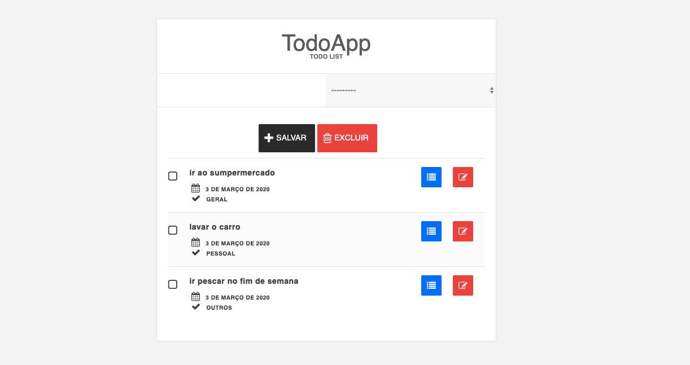

# Todo List Django



### Pre-requisitos

Requisitos minimos para utilização do sistema:

```
Python 3.6.2+
```
```
Django 2.0.2+
```

### Instalação

A seguir um passo a passo para a instalação do sistema e suas dependências

* clone o projeto:
```
git clone https://github.com/diegocostacmp/todo-list-django.git
```
* Certifique-se de que o Python e o Ambiente Virtual (venv) estejam instalados.
Crie o ambiente virtual e instale os pacotes.
 ```
 cd todo-list-django
 virtualenv venv
 source venv/bin/activate
 pip install -r requirements.txt
```
* Execute as migrações do banco de dados:

```
python manage.py makemigrations
python manage.py migrate
```


## Construido com

* [Python](https://www.python.org/) - Linguagem de programacao
* [Django](https://www.djangoproject.com/) - Framework python


## Autores

* **Diego B B Costa** - *Trabalho inicial* - [Ver...****](https://github.com/diegocostacmp)

## Licenca

This project is licensed under the MIT License.


